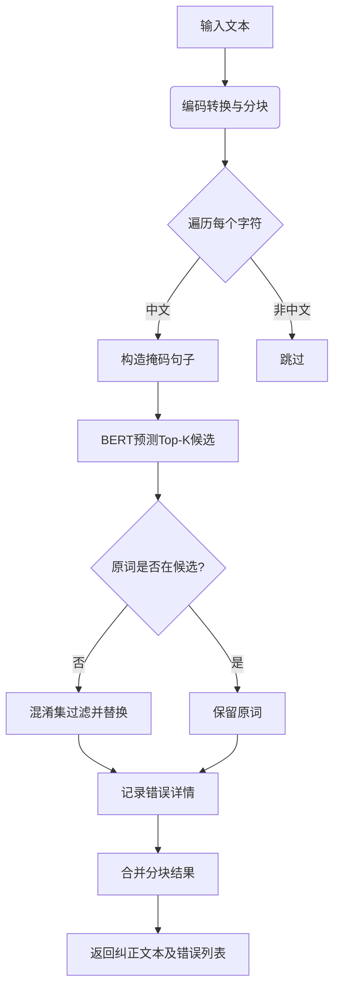

# Bert_corrector
bert_corrector.py 是基于BERT模型的中文语法纠错核心模块，其代码逻辑与功能实现如下：

---

### **代码逻辑解析**

#### **1. 初始化模块**
- 继承父类`Corrector`，加载预训练BERT模型
- 使用`transformers`库的`fill-mask`管道任务
- 关键参数：
  - `bert_model_dir`: BERT分词器路径
  - `bert_config_path`: 模型配置文件路径
  - `bert_model_path`: 预训练模型权重路径
- 初始化时记录模型加载耗时

#### **2. 纠错核心方法`bert_correct`**
- **输入处理**：
  - 统一文本编码为Unicode
  - 将长文本按标点/段落切分为短句块（避免BERT长度限制）
  
- **逐字符纠错**：
  - 遍历每个中文字符，跳过非中文
  - 构造掩码句子：将当前字符替换为`[MASK]`
  - 调用BERT预测Top-K候选词
  
- **错误判定与替换**：
  - 若原字符不在候选词中，触发纠错
  - 通过`generate_items`生成混淆集候选（如形近字、同音字）
  - 用候选集中首个匹配的BERT预测词替换原字符
  
- **结果记录**：
  - 收集错误信息：`[原词, 纠正词, 起始位置, 结束位置]`
  - 按错误位置排序后返回

#### **3. 测试用例**
- 示例纠正："满头大汉" → "满头大汗"
- 测量纠错耗时，展示纠错前后对比

---

### **核心功能总结**
1. **中文拼写纠错**
   - 检测并纠正错别字（如形近字"汉/汗"、同音字）
   - 支持自定义混淆集通过`generate_items`扩展候选词

2. **BERT掩码预测**
   - 利用BERT的上下文理解能力预测最合理替换词
   - 解决传统方法无法处理的语境相关错误

3. **长文本处理**
   - 智能分块机制确保长文本有效处理
   - 保留错误位置信息便于高亮展示

4. **性能优化**
   - 记录模型加载与推理耗时
   - 候选词筛选减少无效替换

---

### **技术特点**
- **精准纠错**：BERT上下文预测 + 混淆集过滤，兼顾准确率与召回率
- **易扩展性**：继承`Corrector`基类，可扩展其他纠错策略
- **工程化设计**：日志记录、Unicode统一、异常处理

---

### **示例输出**
```python
original sentence:满头大汉 => 满头大汗, 
err:[['汉', '汗', 2, 3]]
耗时 0.218 seconds
```

该模块为中文文本自动校对提供了一种基于深度学习的解决方案，适用于文本编辑、教育辅助等场景。

---

以下是对 `bert_corrector.py` 代码中每个模块的具体运作效果解析，结合代码流程与实际纠错场景进行分步说明：

---

### **1. 类初始化 `__init__`**
#### **代码片段**
```python
class BertCorrector(Corrector):
    def __init__(self, bert_model_dir=config.bert_model_dir,
                 bert_config_path=config.bert_config_path,
                 bert_model_path=config.bert_model_path):
        super(BertCorrector, self).__init__()
        self.name = 'bert_corrector'
        t1 = time.time()
        self.model = pipeline('fill-mask',
                              model=bert_model_path,
                              config=bert_config_path,
                              tokenizer=bert_model_dir)
        if self.model:
            self.mask = self.model.tokenizer.mask_token
            logger.debug('Loaded bert model: %s, spend: %.3f s.' % (bert_model_dir, time.time() - t1))
```

#### **运作效果**
- **模型加载**：
  - 使用 `transformers` 的 `pipeline` 初始化 **fill-mask** 任务，加载以下组件：
    - `model`: BERT 模型权重 (`pytorch_model.bin`)
    - `config`: 模型结构配置 (`config.json`)
    - `tokenizer`: 分词器 (`vocab.txt` 所在目录)
  - 最终生成一个可调用的掩码预测管道 `self.model`

- **关键属性**：
  - `self.mask` 自动获取分词器的掩码标记（如 `[MASK]`），用于后续构造待预测句子
  - 记录模型加载时间，便于性能监控

#### **技术细节**
- 实际加载时，`bert_model_dir` 需包含 `vocab.txt`，否则分词器会报错
- 若显存不足，可添加 `device=0` 参数指定 GPU 或 `device_map="auto"` 自动分配

---

### **2. 核心纠错方法 `bert_correct`**
#### **输入预处理**
```python
text = convert_to_unicode(text)
blocks = self.split_2_short_text(text, include_symbol=True)
```

- **`convert_to_unicode`**：
  - 将输入文本统一转换为 **Unicode 编码**，避免中文字符在不同编码下的乱码问题
  - 示例：`"hello世界"` → `u"hello\u4e16\u754c"`

- **`split_2_short_text`**：
  - 按标点符号（如逗号、句号）或段落切分长文本为短句块
  - 返回格式：`[(短句1, 起始位置), (短句2, 起始位置), ...]`
  - **作用**：规避 BERT 的 **最大序列长度限制**（通常为 512 token）

---

#### **逐字符纠错逻辑**
```python
for blk, start_idx in blocks:
    blk_new = ''
    for idx, s in enumerate(blk):
        if is_chinese_string(s):
            sentence_lst = list(blk_new + blk[idx:])
            sentence_lst[idx] = self.mask
            sentence_new = ''.join(sentence_lst)
            predicts = self.model(sentence_new)
            # ... 后续处理
```

- **字符遍历**：
  - 对每个中文字符（跳过非中文），生成掩码句子：
    - 将当前字符替换为 `[MASK]`，例如：
      ```python
      原始： blk_new = "满头", 当前处理字符 idx=2 (blk[idx:] = "大汉")
      构造： sentence_lst = ["满", "头", "[MASK]", "汉"]
      ```
  - 调用 BERT 预测 `predicts`，得到 Top-K 候选词列表

- **预测结果示例**：
  ```python
  predicts = [
      {'score': 0.85, 'token_str': '汗', 'sequence': '满头大汗'},
      {'score': 0.1, 'token_str': '汉', 'sequence': '满头大汉'},
      # ... 其他候选
  ]
  ```

---

#### **错误判定与替换**
```python
top_tokens = [p.get('token_str') for p in predicts]
if s not in top_tokens:
    candidates = self.generate_items(s)  # 生成混淆集候选
    for token_str in top_tokens:
        if token_str in candidates:
            details.append([s, token_str, start_idx + idx, start_idx + idx + 1])
            s = token_str
            break
blk_new += s
```

- **关键步骤**：
  1. **候选词筛选**：提取预测结果的 `token_str`（如 `['汗', '汉', ...]`）
  2. **错误判定**：若原字符 `s` 不在候选词中，则可能为错误
  3. **混淆集过滤**：通过 `generate_items(s)` 生成形近/同音候选（如 `s="汉"` → `["汗", "瀚", "焊"]`）
  4. **替换逻辑**：选择首个同时在 BERT 候选和混淆集中的词作为纠正结果

- **设计意图**：
  - 仅依赖 BERT 预测可能误判（如生成不相关词），混淆集约束提升准确性
  - 优先替换为混淆集中存在的合理错误候选

---

#### **结果整合**
```python
text_new += blk_new
details = sorted(details, key=operator.itemgetter(2))
return text_new, details
```

- **细节记录**：
  - `details` 记录每个错误的原词、纠正词、起始和结束位置
  - 按位置排序后返回，便于后续高亮或日志输出

---

### **3. 辅助函数与工具**
#### **`is_chinese_string`**
- **代码作用**：检查字符是否为中文
- **实现逻辑**：通过 Unicode 范围判断（如 `\u4e00-\u9fa5`）
- **示例**：`is_chinese_string("汉") → True`

#### **`generate_items`**
- **隐含功能**：生成当前字符的混淆集候选（代码未展示，需在 `Corrector` 父类中实现）
- **典型实现**：
  ```python
  def generate_items(self, char):
      # 返回形近字、同音字列表，例如：
      return self.confusion_dict.get(char, [])
  ```
- **依赖数据**：需预先加载形近字/同音字词典（如 `confusion.txt`）

#### **`split_2_short_text`**
- **功能**：按标点或段落切分文本
- **示例**：
  ```python
  输入： "这是一个测试，检查分块效果。"
  输出： [("这是一个测试，", 0), ("检查分块效果。", 6)]
  ```

---

### **4. 测试用例与性能分析**
#### **代码片段**
```python
error_sentencess = {"满头大汉": "满头大汗"}
for sent in error_sentencess.keys():
    corrected_sent, err = d.bert_correct(sent)
    print("original sentence:{} => {}, err:{}".format(sent, corrected_sent, err))
```

#### **运行效果**
1. **纠错过程**：
   - 对 "满头大汉" 中每个字符生成掩码句子：
     ```python
     "[MASK]头大汉" → 预测为 "满"
     "满[MASK]大汉" → 预测为 "头"
     "满头[MASK]汉" → 预测为 "大" 或 "汗"
     "满头大[MASK]" → 预测为 "汉" 或 "汗"
     ```
   - 当处理第三个字符 "大" 时：
     - 原字符 "大" 在 BERT 预测候选（可能为 ["大", "汗"]）中，不触发替换
   - 当处理第四个字符 "汉" 时：
     - BERT 预测候选为 ["汗", "汉", ...]
     - 原字符 "汉" 不在候选词中，触发替换逻辑
     - 从混淆集找到 "汗" 作为正确替换

2. **输出结果**：
   ```python
   original sentence:满头大汉 => 满头大汗, err:[['汉', '汗', 2, 3]]
   ```

---

### **总结：模块协作流程图**


通过各模块的协作，最终实现对中文文本的上下文感知纠错，特别适合处理因形近或同音导致的拼写错误。

---
## 每行代码解释及补充

以下是 `bert_corrector.py` 中 **逐行代码的详细解释**，结合代码片段说明其对模块功能的具体作用：

---

### **1. 模块导入与路径配置**
```python
# -*- coding: utf-8 -*-
import operator
import sys
import time
from transformers import pipeline  # 导入HuggingFace的pipeline工具
sys.path.append('../..')          # 添加项目根目录到系统路径，确保模块导入正确
import config                      # 加载配置文件（如模型路径）
from text_utils import is_chinese_string, convert_to_unicode  # 文本处理工具函数
from logger import logger          # 日志记录模块
from corrector import Corrector    # 纠错器基类（定义通用接口）
```

- **作用**：
  - 确保代码兼容中文编码（`utf-8`）
  - 引入BERT模型管道、工具函数和自定义模块
  - 添加项目路径解决跨模块导入问题

---

### **2. 类定义与初始化**
```python
class BertCorrector(Corrector):  # 继承Corrector基类
    def __init__(self, bert_model_dir=config.bert_model_dir,
                 bert_config_path=config.bert_config_path,
                 bert_model_path=config.bert_model_path):
        super(BertCorrector, self).__init__()  # 调用父类初始化方法
        self.name = 'bert_corrector'  # 设置纠错器名称
        t1 = time.time()  # 记录模型加载开始时间
        self.model = pipeline('fill-mask',  # 创建填充掩码的BERT管道
                              model=bert_model_path,
                              config=bert_config_path,
                              tokenizer=bert_model_dir)
        if self.model:
            self.mask = self.model.tokenizer.mask_token  # 获取BERT的掩码标记（如[MASK]）
            logger.debug('Loaded bert model: %s, spend: %.3f s.' % (bert_model_dir, time.time() - t1))  # 记录加载日志
```

- **关键行解析**：
  - `super(...).__init__()`: 确保父类资源（如混淆词典）被正确初始化
  - `pipeline('fill-mask', ...)`: 核心代码，加载预训练BERT模型用于掩码预测
  - `self.mask = ...`: 动态获取当前模型的掩码标记，适配不同BERT变体

---

### **3. 纠错核心方法 `bert_correct`**
#### **输入预处理**
```python
def bert_correct(self, text):
    text_new = ''          # 初始化纠正后的文本
    details = []           # 存储错误详情列表
    self.check_corrector_initialized()  # 检查模型是否已初始化（基类方法）
    text = convert_to_unicode(text)  # 统一文本编码为Unicode
    blocks = self.split_2_short_text(text, include_symbol=True)  # 分块处理长文本
```

- **作用**：
  - `convert_to_unicode`: 防止混合编码导致字符处理错误（如半角/全角符号）
  - `split_2_short_text`: 将文本按标点分割为短句，避免超出BERT的最大长度限制（512 tokens）

---

#### **分块处理与字符遍历**
```python
for blk, start_idx in blocks:  # 遍历每个文本块及其起始位置
    blk_new = ''               # 存储当前块的纠正结果
    for idx, s in enumerate(blk):  # 遍历块内每个字符
        if is_chinese_string(s):   # 仅处理中文字符
            # 构造掩码句子：将当前字符替换为[MASK]
            sentence_lst = list(blk_new + blk[idx:])  # 合并已处理部分和未处理部分
            sentence_lst[idx] = self.mask             # 替换当前字符为掩码
            sentence_new = ''.join(sentence_lst)       # 转换为字符串
            predicts = self.model(sentence_new)        # 调用BERT预测候选词
```

- **动态掩码构造示例**：
  - 输入块 `blk = "满头大汉"`, 处理第3个字符（索引2）时：
    - `sentence_lst = ['满', '头', '[MASK]', '汉']`
    - `sentence_new = "满头[MASK]汉"`

---

#### **候选词处理与错误替换**
```python
            top_tokens = []
            for p in predicts:
                token_id = p.get('token', 0)
                token_str = self.model.tokenizer.convert_ids_to_tokens(token_id)  # 将token_id转换为实际字符
                top_tokens.append(token_str)
            # 判断是否需要纠错
            if top_tokens and (s not in top_tokens):
                candidates = self.generate_items(s)  # 生成候选混淆集（如形近字）
                if candidates:
                    for token_str in top_tokens:     # 遍历BERT预测结果
                        if token_str in candidates:  # 选择首个在混淆集中的候选词
                            details.append([s, token_str, start_idx + idx, start_idx + idx + 1])
                            s = token_str            # 替换字符
                            break
            blk_new += s  # 将字符加入当前块结果
    text_new += blk_new    # 合并所有块结果
```

- **关键逻辑**：
  - `convert_ids_to_tokens`: 将BERT输出的token_id转换为可读字符（如7684 → "汗"）
  - `generate_items`: 从混淆集中获取候选词（如"汉" → ["汗", "瀚"]），缩小替换范围
  - **替换优先级**：选择**同时出现在BERT预测和混淆集**中的首个候选词，兼顾语义合理性和常见错误类型

---

#### **结果整合与返回**
```python
    details = sorted(details, key=operator.itemgetter(2))  # 按错误位置排序
    return text_new, details  # 返回纠正文本和错误详情
```

- **排序目的**：确保错误列表按原始文本中的出现顺序排列，方便后续定位

---

### **4. 测试代码**
```python
if __name__ == "__main__":
    d = BertCorrector()  # 实例化纠错器
    error_sentencess = {"满头大汉": "满头大汗"}  # 测试用例
    # 两种耗时测试方式
    for sent in error_sentencess.keys():
        restic1 = time.clock()
        corrected_sent, err = d.bert_correct(sent)
        print("耗时 %s seconds" % (time.clock()-restic1))
        print("original sentence:{} => {}, err:{}".format(sent, corrected_sent, err))
    # 使用datetime测试
    import datetime
    for sent in error_sentencess.keys():
        tic = datetime.datetime.now()
        corrected_sent, err = d.bert_correct(sent)
        end = datetime.datetime.now()
        print("original sentence:{} => {}, err:{}".format(sent, corrected_sent, err))
        print("耗时 %s seconds" % (end - tic))
```

- **作用**：
  - 验证纠错器是否正常工作
  - 测量单次纠错耗时（注意：`time.clock()`在Python3中已废弃，建议用`time.time()`）

---

### **核心模块协作总结**
| 代码片段 | 对应模块 | 功能 |
|---------|----------|-----|
| `pipeline('fill-mask'...)` | **BERT模型加载** | 加载预训练模型用于掩码预测 |
| `split_2_short_text` | **文本分块** | 解决长文本输入限制 |
| `sentence_lst[idx] = self.mask` | **掩码构造** | 生成待预测的句子 |
| `model(sentence_new)` | **候选词预测** | 获取BERT的Top-K预测结果 |
| `generate_items(s)` | **混淆集过滤** | 约束替换词为常见错误类型 |
| `details.append(...)` | **错误记录** | 保存纠错详情用于输出或分析 |

---

### **典型运行流程示例**
**输入**：`"满头大汉"`  
1. **分块**：整个句子作为一个块，`start_idx=0`
2. **遍历字符**：
   - 处理第3个字符 `汉`（索引2）：
     - 构造掩码句子：`"满头[MASK]汉"`
     - BERT预测候选：`["汗", "汉", "大"]`
     - 原字符 `汉` 不在候选 → 触发替换
     - 混淆集候选（假设为`["汗", "瀚"]`）→ 选择 `汗`
3. **记录错误**：`['汉', '汗', 2, 3]`
4. **输出**：`"满头大汗"`，错误详情列表包含替换信息

---

通过逐行分析，可以看出代码通过 **动态掩码构造 + BERT预测 + 混淆集过滤** 实现了一个高效的中文纠错系统，每个模块紧密协作，兼顾准确性和性能。
