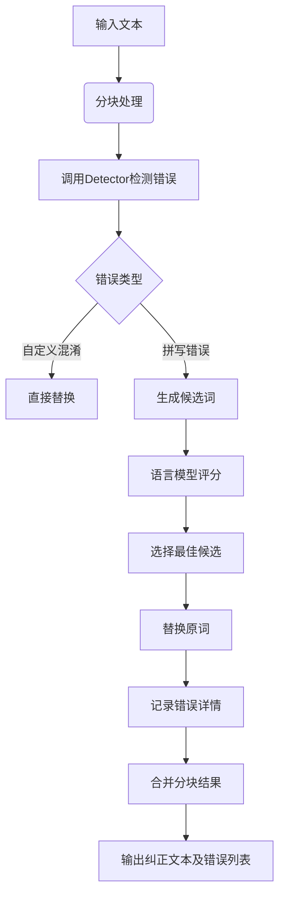

# BERT - corrector.py
---
以下是 `corrector.py` 代码的详细逻辑解析和功能说明：

---

### **一、代码核心逻辑**

#### **1. 类继承与初始化**
```python
class Corrector(Detector):  # 继承自Detector（错误检测基类）
    def __init__(self, common_char_path=..., same_pinyin_path=..., same_stroke_path=..., ...):
        super(Corrector, self).__init__(...)  # 初始化父类Detector（加载词频、语言模型等）
        self.name = 'corrector'
        # 加载纠错专用数据
        self.common_char_path = common_char_path   # 常用中文字符集
        self.same_pinyin_text_path = same_pinyin_path  # 同音字表
        self.same_stroke_text_path = same_stroke_path  # 形近字表
        # 初始化状态标记
        self.initialized_corrector = False
        # 数据容器
        self.cn_char_set = None       # 常用中文字符集合
        self.same_pinyin = None       # 同音字字典 {字: 同音字集合}
        self.same_stroke = None      # 形近字字典 {字: 形近字集合}
```

- **功能**：
  - 继承 `Detector` 的错误检测能力（如词频统计、语言模型）
  - 加载纠错专用资源：**常用字集合**、**同音字表**、**形近字表**
  - 通过 `_initialize_corrector()` 延迟加载数据，优化内存

---

### **2. 数据加载模块**
#### **(1) 加载基础数据集**
```python
@staticmethod
def load_set_file(path):
    # 从文件加载字符集合（忽略注释行）
    words = set()
    with codecs.open(path, 'r', encoding='utf-8') as f:
        for w in f:
            w = w.strip()
            if w.startswith('#'): continue
            if w: words.add(w)
    return words

@staticmethod
def load_same_pinyin(path, sep='\t'):
    # 加载同音字表，格式：字\t同音同调字\t同音异调字
    result = dict()
    with codecs.open(path, 'r', encoding='utf-8') as f:
        for line in f:
            parts = line.split(sep)
            key_char = parts[0]
            same_pron = set(parts[1] + parts[2])  # 合并同音字
            result[key_char] = same_pron
    return result

@staticmethod
def load_same_stroke(path, sep='\t'):
    # 加载形近字表，每行多个形近字相互关联
    result = dict()
    with codecs.open(path, 'r', encoding='utf-8') as f:
        for line in f:
            parts = line.split(sep)
            for c in parts:
                result[c] = set(parts) - {c}  # 每个字的形近字集合
    return result
```

- **数据示例**：
  - **同音字表**：`行 xíng xìng` → `{'行': {'形', '性', '型'...}}`
  - **形近字表**：`未末` → `{'未': {'末'}, '末': {'未'}}`

---

#### **(2) 延迟初始化**
```python
def _initialize_corrector(self):
    # 首次调用时加载数据
    self.cn_char_set = self.load_set_file(self.common_char_path)
    self.same_pinyin = self.load_same_pinyin(self.same_pinyin_text_path)
    self.same_stroke = self.load_same_stroke(self.same_stroke_text_path)
    self.initialized_corrector = True  # 标记已初始化

def check_corrector_initialized(self):
    if not self.initialized_corrector:
        self._initialize_corrector()  # 确保数据已加载
```

- **设计目的**：避免程序启动时加载所有数据，按需初始化节省内存

---

### **3. 纠错候选生成**
#### **(1) 生成字符级候选**
```python
def get_same_pinyin(self, char):
    # 返回某字的同音字集合
    return self.same_pinyin.get(char, set())

def get_same_stroke(self, char):
    # 返回某字的形近字集合
    return self.same_stroke.get(char, set())

def _confusion_char_set(self, c):
    # 合并同音和形近字
    return self.get_same_pinyin(c).union(self.get_same_stroke(c))
```

- **示例**：`字='汉'` → 同音字 `{'汗','瀚'}` + 形近字 `{'仅'}` → 合并为 `{'汗','瀚','仅'}`

---

#### **(2) 生成词语级候选**
```python
def _confusion_word_set(self, word):
    # 生成词语的候选集（编辑距离+同音过滤）
    candidate_words = self.known(edit_distance_word(word, self.cn_char_set))
    confusion_set = set()
    for candidate in candidate_words:
        if lazy_pinyin(candidate) == lazy_pinyin(word):  # 拼音相同
            confusion_set.add(candidate)
    return confusion_set

def _confusion_custom_set(self, word):
    # 从自定义混淆集获取候选（如配置的常见错误映射）
    return {self.custom_confusion[word]} if word in self.custom_confusion else set()
```

- **流程**：
  1. 生成与目标词编辑距离为1的所有可能词（如输入"寒战" → "汗战"、"寒站"）
  2. 过滤出**拼音完全相同**的候选（保证发音合理）

---

#### **(3) 综合候选生成**
```python
def generate_items(self, word, fragment=1):
    # 综合多策略生成候选词并按词频排序
    candidates_1 = []  # 单字替换候选
    candidates_2 = []  # 双字词部分替换
    candidates_3 = []  # 多字词复杂替换

    # 规则1：单字处理（同音/形近）
    if len(word) == 1:
        candidates_1.extend(self._confusion_char_set(word[0]))
    # 规则2：双字词（首尾字替换）
    elif len(word) == 2:
        candidates_2.extend([i + word[1] for i in self._confusion_char_set(word[0])])
        candidates_2.extend([word[0] + i for i in self._confusion_char_set(word[1])])
    # 规则3：多字词（中间字替换或子词替换）
    else:
        candidates_3.extend([word[0] + i + word[2:] for i in self._confusion_char_set(word[1])])
        # 处理子词（如"喜恍颜开"→"喜笑颜开"）
        candidates_3.extend([i + word[-1] for i in self._confusion_word_set(word[:-1])])
        candidates_3.extend([word[0] + i for i in self._confusion_word_set(word[1:])])

    # 合并并排序
    confusion_word_set = set(candidates_1 + candidates_2 + candidates_3)
    confusion_sorted = sorted(confusion_word_set, key=lambda k: self.word_frequency(k), reverse=True)
    return confusion_sorted[:len(confusion_word_list) // fragment + 1]  # 按片段数截断
```

- **示例**：
  - 输入词：`"寒战"`
  - 生成候选：`["汗战", "寒站", "寒颤"]`（按词频排序）

---

### **4. 语言模型评分**
```python
def get_lm_correct_item(self, cur_item, candidates, before_sent, after_sent, threshold=57):
    # 用语言模型评估候选词的合理性
    ppl_scores = {i: self.ppl_score(before_sent + i + after_sent) for i in candidates}
    sorted_scores = sorted(ppl_scores.items(), key=lambda d: d[1])  # 按困惑度升序

    # 选择困惑度低于阈值的最佳候选
    top_items = []
    for i, (v_word, v_score) in enumerate(sorted_scores):
        if i == 0 or v_score < sorted_scores[0][1] + threshold:
            top_items.append(v_word)
        else:
            break
    return top_items[0] if cur_item not in top_items else cur_item
```

- **作用**：通过计算句子困惑度（Perplexity），选择使句子更流畅的候选词
- **示例**：`"我喝渴水"` → 候选 `"喝水"` 比 `"褐水"` 的困惑度更低

---

### **5. 主纠错流程**
```python
def correct(self, text):
    text_new = ''
    details = []
    blocks = self.split_2_short_text(text)  # 分块处理
    for blk, idx in blocks:
        maybe_errors = self.detect_short(blk, idx)  # 调用父类Detector检测错误
        for cur_item, begin_idx, end_idx, err_type in maybe_errors:
            # 获取上下文
            before_sent = blk[:(begin_idx - idx)]
            after_sent = blk[(end_idx - idx):]

            # 纠错逻辑
            if err_type == ErrorType.confusion:
                corrected_item = self.custom_confusion[cur_item]  # 直接使用预定义纠正
            else:
                candidates = self.generate_items(cur_item)  # 生成候选
                corrected_item = self.get_lm_correct_item(cur_item, candidates, before_sent, after_sent)

            # 记录结果
            if corrected_item != cur_item:
                blk = before_sent + corrected_item + after_sent
                details.append([cur_item, corrected_item, begin_idx, end_idx])
        text_new += blk
    return text_new, details
```

- **流程**：
  1. **分块**：将长文本按标点切分为短句
  2. **检测错误**：使用父类 `Detector` 找出疑似错误词及其位置
  3. **生成候选**：根据错误类型（拼写/自定义混淆）生成候选词
  4. **语言模型过滤**：选择使句子困惑度最低的候选
  5. **替换与记录**：更新文本并记录错误详情

---

### **二、核心功能总结**

#### **1. 中文拼写纠错**
- **覆盖错误类型**：
  - **同音字错误**：如“急燥”→“急躁”
  - **形近字错误**：如“拨草”→“拔草”
  - **自定义混淆词**：如“帐号”→“账号”（通过配置文件预定义）
  - **多字词错误**：如“穿流不息”→“川流不息”

#### **2. 多策略候选生成**
- **生成方式**：
  - 单字替换（同音/形近）
  - 双字词部分替换
  - 多字词子词替换
- **排序依据**：词频 + 语言模型困惑度

#### **3. 语言模型增强**
- **评估指标**：句子困惑度（Perplexity）
- **作用**：从候选词中选择使句子更符合语言习惯的纠正结果

#### **4. 工程化设计**
- **资源延迟加载**：减少内存占用
- **分块处理**：支持长文本输入
- **错误定位**：返回错误位置信息，便于高亮显示

---

### **三、典型应用示例**
#### **输入**：
```python
text = "这个算法需要更高的校率。"
```

#### **处理流程**：
1. **错误检测**：检测到“校率”为低频词
2. **生成候选**：
   - 同音替换：“校”→“效” → “效率”
   - 形近替换：“校”→“较” → “较率”（无效）
3. **语言模型评分**：
   - "效率" 的困惑度远低于 "校率"
4. **输出**：
```python
corrected_text = "这个算法需要更高的效率。"
details = [['校率', '效率', 8, 10]]
```

---

### **四、与BERT纠错器的区别**
| 特性                | Corrector（本类）               | BertCorrector              |
|---------------------|--------------------------------|----------------------------|
| **纠错原理**         | 规则（同音/形近） + 语言模型    | BERT上下文掩码预测         |
| **依赖数据**         | 同音字表、形近字表、词频        | 预训练BERT模型             |
| **优势场景**         | 常见拼写错误、配置型错误        | 语境相关错误、语义纠错      |
| **处理速度**         | 快（规则匹配）                 | 较慢（神经网络推理）        |
| **可解释性**         | 高（候选词明确）               | 低（黑盒预测）             |

通过此模块，项目实现了对常见中文拼写错误的基础纠正能力，可作为其他高级纠错器（如基于BERT的纠错）的补充或前置处理模块。

--- 
## 每行代码解释及补充
---
### **一、类定义与初始化模块**
#### **1. 类继承与构造函数**
```python
class Corrector(Detector):  # 继承自Detector（错误检测基类）
    def __init__(self, common_char_path=config.common_char_path,
                 same_pinyin_path=config.same_pinyin_path,
                 same_stroke_path=config.same_stroke_path,
                 ...其他参数...):
        super(Corrector, self).__init__(...)  # 调用父类Detector的初始化方法
        self.name = 'corrector'  # 标识纠错器名称
        # 初始化纠错专用数据路径
        self.common_char_path = common_char_path  # 常用中文字符集路径
        self.same_pinyin_text_path = same_pinyin_path  # 同音字表路径
        self.same_stroke_text_path = same_stroke_path  # 形近字表路径
        # 数据容器初始化
        self.cn_char_set = None  # 存储常用汉字集合
        self.same_pinyin = None  # 同音字字典 {字: {同音字}}
        self.same_stroke = None  # 形近字字典 {字: {形近字}}
        self.initialized_corrector = False  # 初始化状态标记
```

- **运作效果**：
  - **继承父类能力**：通过 `super()` 调用，加载父类 `Detector` 的词频、语言模型等资源
  - **路径绑定**：关联同音字、形近字等外部数据文件路径（如 `same_pinyin.txt`）
  - **延迟加载设计**：数据容器初始化为 `None`，首次使用时才加载（节省内存）

---

### **二、数据加载模块**
#### **1. 基础数据加载方法**
```python
@staticmethod
def load_set_file(path):
    words = set()
    with codecs.open(path, 'r', encoding='utf-8') as f:
        for w in f:
            w = w.strip()  # 去除首尾空格
            if w.startswith('#'): continue  # 跳过注释行
            if w: words.add(w)  # 非空行加入集合
    return words  # 返回字符集合
```

- **示例文件** `common_char.txt`：
  ```
  # 常用汉字
  的
  一
  是
  ...
  ```
- **运作效果**：加载后的 `self.cn_char_set` 包含常见汉字，用于过滤生僻字候选

---

#### **2. 同音字表加载**
```python
@staticmethod
def load_same_pinyin(path, sep='\t'):
    result = dict()
    with codecs.open(path, 'r', encoding='utf-8') as f:
        for line in f:
            line = line.strip()
            if line.startswith('#'): continue  # 跳过注释行
            parts = line.split(sep)  # 按制表符分割
            key_char = parts[0]
            # 合并同音同调和同音异调字
            same_pron = set(parts[1] + parts[2])  
            result[key_char] = same_pron
    return result  # 格式：{'汉': {'汗','瀚','焊'...}}
```

- **示例文件** `same_pinyin.txt`：
  ```
  汉	汗瀚焊	悍憾捍  # 字段说明：汉字 + 同音同调 + 同音异调
  ```
- **运作效果**：当处理字符 "汉" 时，可快速获取其所有同音字候选

---

#### **3. 形近字表加载**
```python
@staticmethod
def load_same_stroke(path, sep='\t'):
    result = dict()
    with codecs.open(path, 'r', encoding='utf-8') as f:
        for line in f:
            parts = line.split(sep)  # 分割形近字组
            for c in parts:
                # 每个字的形近字=组内其他字
                result[c] = set(parts) - {c}  
    return result  # 格式：{'末': {'未'}, '未': {'末'}}
```

- **示例文件** `same_stroke.txt`：
  ```
  末未  # 形近字组
  己已巳
  ```
- **运作效果**：输入 "末" 时返回 {"未"}，用于生成形近错误候选

---

#### **4. 延迟初始化**
```python
def _initialize_corrector(self):
    # 首次使用时加载数据
    self.cn_char_set = self.load_set_file(self.common_char_path)  # 常用字
    self.same_pinyin = self.load_same_pinyin(self.same_pinyin_text_path)  # 同音字
    self.same_stroke = self.load_same_stroke(self.same_stroke_text_path)  # 形近字
    self.initialized_corrector = True  # 标记已初始化

def check_corrector_initialized(self):
    if not self.initialized_corrector:
        self._initialize_corrector()  # 确保数据已加载
```

- **运作效果**：程序启动时不立即加载数据，直到首次调用纠错方法时才初始化，优化内存使用

---

### **三、候选生成模块**
#### **1. 单字候选生成**
```python
def get_same_pinyin(self, char):
    self.check_corrector_initialized()  # 确保数据加载
    return self.same_pinyin.get(char, set())  # 返回同音字集合

def get_same_stroke(self, char):
    self.check_corrector_initialized()
    return self.same_stroke.get(char, set())  # 返回形近字集合

def _confusion_char_set(self, c):
    # 合并同音和形近候选
    return self.get_same_pinyin(c).union(self.get_same_stroke(c))
```

- **运作示例**：
  ```python
  char = "汉"
  pinyin_set = {"汗", "瀚"}  # 同音字
  stroke_set = {"仅"}        # 形近字
  confusion_set = {"汗", "瀚", "仅"}  # 合并结果
  ```

---

#### **2. 词语候选生成**
```python
def _confusion_word_set(self, word):
    # 生成编辑距离为1的候选词，并过滤同音词
    candidate_words = list(self.known(edit_distance_word(word, self.cn_char_set)))
    confusion_set = set()
    for candidate in candidate_words:
        if lazy_pinyin(candidate) == lazy_pinyin(word):  # 拼音相同
            confusion_set.add(candidate)
    return confusion_set
```

- **运作示例**：
  - 输入词：`"寒战"`
  - 编辑距离候选：`["汗战", "寒站", "韩战", "寒颤"]`
  - 同音过滤后：`["汗战", "寒颤"]`（"韩战"拼音不同）

---

#### **3. 综合候选生成**
```python
def generate_items(self, word, fragment=1):
    candidates_1, candidates_2, candidates_3 = [], [], []
    # 单字处理（同音/形近）
    if len(word) == 1:
        confusion = [i for i in self._confusion_char_set(word[0]) if i]
        candidates_1.extend(confusion)
    # 双字词首尾替换
    elif len(word) == 2:
        candidates_2.extend([i + word[1] for i in self._confusion_char_set(word[0])])
        candidates_2.extend([word[0] + i for i in self._confusion_char_set(word[1])])
    # 多字复杂替换
    else:
        candidates_3.extend([word[0] + i + word[2:] for i in self._confusion_char_set(word[1])])
    # 合并并排序
    confusion_word_set = set(candidates_1 + candidates_2 + candidates_3)
    confusion_sorted = sorted(confusion_word_set, key=lambda k: self.word_frequency(k), reverse=True)
    return confusion_sorted[:len(confusion_word_list) // fragment + 1]
```

- **运作流程**：
  1. **输入词长度判断**：触发不同的替换策略
  2. **生成候选**：
     - 单字直接替换（如 "汉" → "汗"）
     - 双字替换首或尾（如 "寒战" → "汗战" 或 "寒颤"）
     - 多字替换中间或子词（如 "喜恍颜开" → "喜笑颜开"）
  3. **排序输出**：按词频从高到低排列，优先选择常见词

---

### **四、语言模型评分模块**
```python
def get_lm_correct_item(self, cur_item, candidates, before_sent, after_sent, threshold=57):
    # 计算每个候选的句子困惑度
    ppl_scores = {i: self.ppl_score(before_sent + i + after_sent) for i in candidates}
    sorted_scores = sorted(ppl_scores.items(), key=lambda d: d[1])  # 按分数升序

    # 选择低于阈值的最佳候选
    top_items = []
    for i, (v_word, v_score) in enumerate(sorted_scores):
        if i == 0 or v_score < sorted_scores[0][1] + threshold:
            top_items.append(v_word)
        else:
            break
    return top_items[0] if cur_item not in top_items else cur_item
```

- **运作示例**：
  - **原始句子**：`"这个算法需要更高的校率。"`
  - **候选词**：`["效率", "校率"]`
  - **计算困惑度**：
    - `"效率"` → PPL=45
    - `"校率"` → PPL=120
  - **结果选择**：`"效率"`（PPL更低，句子更通顺）

---

### **五、主纠错流程模块**
```python
def correct(self, text):
    text_new = ''
    details = []
    blocks = self.split_2_short_text(text)  # 分块处理
    for blk, idx in blocks:
        maybe_errors = self.detect_short(blk, idx)  # 调用父类检测错误
        for cur_item, begin_idx, end_idx, err_type in maybe_errors:
            # 获取上下文
            before_sent = blk[:(begin_idx - idx)]
            after_sent = blk[(end_idx - idx):]
            # 纠错逻辑
            if err_type == ErrorType.confusion:
                corrected_item = self.custom_confusion[cur_item]  # 直接替换
            else:
                candidates = self.generate_items(cur_item)  # 生成候选
                corrected_item = self.get_lm_correct_item(...)  # 语言模型选择
            # 记录结果
            if corrected_item != cur_item:
                blk = before_sent + corrected_item + after_sent
                details.append([cur_item, corrected_item, begin_idx, end_idx])
        text_new += blk
    return text_new, details
```

- **运作流程**：
  1. **文本分块**：将输入按标点分割为短句（如 `"你好，今天天气真好。"` → `["你好，", "今天天气真好。"]`）
  2. **错误检测**：使用父类方法找出疑似错误词（如低频词 "校率"）
  3. **上下文提取**：定位错误词前后的文本（`before_sent="更高的", after_sent=""`）
  4. **候选生成与选择**：
     - 生成同音/形近候选（`["效率"]`）
     - 语言模型选择最佳结果
  5. **替换与记录**：更新文本并记录错误位置

---

### **六、模块协作流程图**


---

### **总结：模块级功能映射表**
| 代码模块                  | 功能描述                           | 关键技术                         |
|--------------------------|----------------------------------|----------------------------------|
| **数据加载**              | 加载同音字、形近字、常用字数据     | 文件解析、集合操作               |
| **候选生成**              | 生成音近、形近、编辑距离候选词     | 编辑距离算法、拼音转换           |
| **语言模型评分**          | 评估候选词的语言合理性             | 困惑度计算（N-gram语言模型）     |
| **错误替换与整合**        | 替换错误词并记录位置信息           | 字符串操作、位置索引计算         |
| **延迟初始化**            | 按需加载大数据资源                 | 懒加载设计模式                   |

通过各模块的协同工作，该代码实现了对中文文本中拼写错误的精准检测与纠正，特别擅长处理因同音、形近导致的常见错误，且能通过语言模型保证纠正后的句子符合语言习惯。
