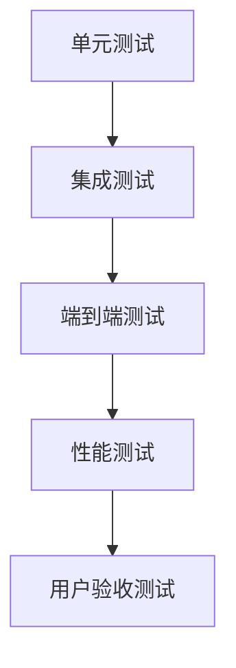

# 测试与验证方案：系统全面评估

## 一、测试策略

### 分层测试方法


### 测试重点
1. **茶餐厅术语处理**
2. **LLM触发机制**
3. **整体纠错准确性**
4. **系统性能**

## 二、测试用例设计

### 1. 茶餐厅术语处理测试
```python
test_cases = [
    # (输入, 期望输出)
    ("一杯0T走冰", "一杯柠檬茶不要冰"),
    ("两个罗友烘底", "两个菠萝油面包表皮烤脆"),
    ("靓仔加底谢谢", "白饭加量谢谢"),
    ("夏蕙姨飞边", "西多士去掉面包皮"),
    ("一杯C9T饭扣底", "一杯冻奶茶饭量减少"),
    ("黑牛白牛各一", "可乐+朱古力雪糕雪碧+香草雪糕各一"),
    ("我要OT和CO6", "我要热柠檬红茶和冻柠乐"),
    ("冻T加马", "冻奶茶饭加份量")
]
```

### 2. LLM触发机制测试
```python
trigger_test_cases = [
    # (输入, 期望是否触发LLM, 触发原因)
    ("今天天汽很好我门去茶餐厅", True, "复杂错误"),  # 多个错误
    ("这个菠萝油很正", True, "未知术语"),      # 不在词典中的术语
    ("我要一杯XYZ", True, "未知术语"),        # 完全未知术语
    ("她明天去学校", False, "无错误"),         # 简单正确句子
    ("一杯0T", False, "本地可纠正"),          # 茶餐厅术语，本地可处理
    ("天气很和暖和", True, "通顺度下降")       # 纠错后不通顺
]
```

### 3. 端到端纠错测试
```python
end_to_end_cases = [
    {
        "input": "我要一杯0T走冰",
        "expected_output": "我要一杯柠檬茶不要冰",
        "expected_details": [["0T", "柠檬茶", 4, 6], ["走冰", "不要冰", 6, 8]]
    },
    {
        "input": "两个罗友烘底加个炒底",
        "expected_output": "两个菠萝油面包表皮烤脆加个炒饭",
        "expected_details": [["罗友", "菠萝油", 2, 4], ["烘底", "面包表皮烤脆", 4, 6], ["炒底", "炒饭", 8, 10]]
    },
    {
        "input": "靓仔加底再来个细蓉",
        "expected_output": "白饭加量再来个云吞面",
        "expected_details": [["靓仔", "白饭", 0, 2], ["加底", "加量", 2, 4], ["细蓉", "云吞面", 7, 9]]
    }
]
```

## 三、测试实施

### 1. 单元测试

**文件：`tests/test_text_utils.py`**
```python
import unittest
from utils.text_utils import load_tea_dict, replace_tea_terms

class TestTextUtils(unittest.TestCase):
    def setUp(self):
        self.tea_dict = {
            "0T": ("柠檬茶", 100),
            "OT": ("热柠檬红茶", 100),
            "靓仔": ("白饭", 100),
            "细蓉": ("云吞面", 100)
        }
    
    def test_replace_tea_terms(self):
        self.assertEqual(replace_tea_terms("一杯0T", self.tea_dict), "一杯柠檬茶")
        self.assertEqual(replace_tea_terms("两个靓仔", self.tea_dict), "两个白饭")
        self.assertEqual(replace_tea_terms("OT和0T", self.tea_dict), "热柠檬红茶和柠檬茶")
        self.assertEqual(replace_tea_terms("细蓉加底", self.tea_dict), "云吞面加底")
    
    def test_contains_tea_term(self):
        self.assertTrue(contains_tea_term("一杯0T", self.tea_dict))
        self.assertFalse(contains_tea_term("普通句子", self.tea_dict))
        
if __name__ == "__main__":
    unittest.main()
```

### 2. 集成测试

**文件：`tests/test_corrector_integration.py`**
```python
import unittest
from corrector import Corrector
import config

class TestCorrectorIntegration(unittest.TestCase):
    def setUp(self):
        self.corrector = Corrector(tea_dict_path=config.tea_dict_path)
    
    def test_tea_term_correction(self):
        # 测试茶餐厅术语替换
        text = "一杯0T走冰"
        corrected, _ = self.corrector.correct(text)
        self.assertEqual(corrected, "一杯柠檬茶不要冰")
        
        text = "两个罗友烘底"
        corrected, _ = self.corrector.correct(text)
        self.assertEqual(corrected, "两个菠萝油面包表皮烤脆")
    
    def test_llm_trigger_conditions(self):
        # 测试LLM触发条件
        # 复杂错误应触发LLM
        text = "今天天汽很好我门去茶餐厅吃0T"
        corrected, details = self.corrector.correct(text)
        self.assertGreater(len(details), 2)  # 多个错误
        
        # 未知术语应触发LLM
        text = "这个菠萝油很正"
        corrected, details = self.corrector.correct(text)
        self.assertTrue("菠萝油" not in self.corrector.word_freq)
        
if __name__ == "__main__":
    unittest.main()
```

### 3. 端到端测试

**文件：`tests/test_end_to_end.py`**
```python
import unittest
from bert_corrector import BertCorrector
import config
import time

class TestEndToEnd(unittest.TestCase):
    def setUp(self):
        self.corrector = BertCorrector(tea_dict_path=config.tea_dict_path)
    
    def test_full_correction_flow(self):
        test_cases = [
            ("我要一杯0T走冰", "我要一杯柠檬茶不要冰"),
            ("两个罗友烘底加个炒底", "两个菠萝油面包表皮烤脆加个炒饭"),
            ("靓仔加底再来个细蓉", "白饭加量再来个云吞面")
        ]
        
        for input_text, expected_output in test_cases:
            with self.subTest(input_text=input_text):
                corrected, _ = self.corrector.bert_correct(input_text)
                self.assertEqual(corrected, expected_output)
    
    def test_llm_integration(self):
        # 模拟LLM调用（实际测试可能需要mock）
        input_text = "这个菠萝油很正"
        corrected, _ = self.corrector.bert_correct(input_text)
        # 验证LLM返回的结果格式
        self.assertNotEqual(input_text, corrected)
        self.assertTrue(len(corrected) > 0)
        
if __name__ == "__main__":
    unittest.main()
```

### 4. 性能测试

**文件：`tests/performance_test.py`**
```python
import time
from bert_corrector import BertCorrector
import config

def run_performance_test():
    corrector = BertCorrector(tea_dict_path=config.tea_dict_path)
    test_cases = [
        "一杯0T走冰",
        "两个罗友烘底",
        "靓仔加底谢谢",
        "今天天气很好我们去了茶餐厅",
        "这个语法纠错系统表现非常出色"
    ]
    
    # 单次请求延迟
    print("单次请求测试:")
    for text in test_cases:
        start = time.time()
        corrected, _ = corrector.bert_correct(text)
        elapsed = time.time() - start
        print(f"文本: {text[:20]}... | 耗时: {elapsed:.4f}s | 结果: {corrected[:20]}...")
    
    # 并发测试
    print("\n并发测试 (10次请求):")
    start = time.time()
    for _ in range(10):
        for text in test_cases:
            corrector.bert_correct(text)
    total_time = time.time() - start
    print(f"总耗时: {total_time:.4f}s | 平均每请求: {total_time/(len(test_cases)*10):.4f}s")

if __name__ == "__main__":
    run_performance_test()
```

## 四、评估指标

### 1. 准确性评估
| 指标 | 计算公式 | 目标值 |
|------|----------|--------|
| 术语识别准确率 | 正确识别的术语数 / 总术语数 | >95% |
| 纠错准确率 | 正确纠正的句子数 / 总句子数 | >90% |
| LLM触发准确率 | 正确触发的次数 / 应触发次数 | >85% |

### 2. 性能评估
| 指标 | 目标值 |
|------|--------|
| 平均响应时间 | <1s (本地纠错), <3s (含LLM) |
| 最大内存占用 | <500MB |
| 并发处理能力 | >10 QPS |

### 3. LLM使用评估
| 指标 | 目标值 |
|------|--------|
| LLM调用比例 | <15% 的总请求 |
| LLM平均响应时间 | <2s |
| LLM使用成本 | <$0.1/1000次请求 |

## 五、测试执行流程

1. **环境准备**
   ```bash
   # 创建虚拟环境
   python -m venv test-env
   source test-env/bin/activate
   
   # 安装依赖
   pip install -r requirements.txt
   ```

2. **运行单元测试**
   ```bash
   python -m unittest tests/test_text_utils.py
   python -m unittest tests/test_corrector_integration.py
   ```

3. **运行端到端测试**
   ```bash
   python -m unittest tests/test_end_to_end.py
   ```

4. **运行性能测试**
   ```bash
   python tests/performance_test.py
   ```

5. **生成测试报告**
   ```bash
   # 使用pytest生成HTML报告
   pip install pytest pytest-html
   pytest --html=report.html
   ```

## 六、持续测试建议

1. **自动化测试流水线**
   ```mermaid
   graph LR
     A[代码提交] --> B[运行单元测试]
     B --> C[运行集成测试]
     C --> D[生成测试报告]
     D --> E[部署测试环境]
     E --> F[运行性能测试]
   ```

2. **监控生产环境**
   - 记录LLM调用次数和响应时间
   - 监控错误检测准确率
   - 跟踪用户反馈的纠错问题

3. **A/B测试**
   - 对比有无茶餐厅词典的系统表现
   - 比较不同LLM触发阈值的效果
   - 测试不同模型版本在茶餐厅术语上的表现

这个全面的测试方案确保：
1. 茶餐厅术语被正确处理
2. LLM在合适时机触发
3. 系统在各种场景下表现稳定
4. 性能满足实际应用需求


通过实施这些测试，您可以系统地验证系统的所有功能模块，确保在香港茶餐厅领域的语法纠错任务中表现出色。


venv\Scripts\activate
